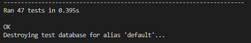

# F1 Experiences


---

## [Project Repository](https://github.com/filleben/F1Experiences)

## [Deployed Site](https://f1-experiences.herokuapp.com/)

---

The goal of this project is to make an application that allows users to view and purchase tickets/race packages to Formula 1 events.

## Table of Contents

- <a href="#ux">UX</a>
- <a href="#features">Features</a>
- <a href="#technologies">Technologies Used</a>
- <a href="#testing">Testing</a>
- <a href="#deployment">Deployment</a>
- <a href="#credits">Credits</a>

<span id="ux"></span>

## UX

### User Goals

I expect that the majority of the users will fall into the following criteria:

- A user looking to purchase event tickets.
- A user looking for information about upcoming events.
- A site manager adding/removing information and race packages.

### User Stories

- As a user, I want to be able to view a list of events.
- As a user, I want to be able to view a list of tickets for each event.
- As a user, I want to be able to view a running total of my puchases.
- As a user, I want to be able to create an account to view and manage my orders.
- As a user, I want to be able to edit and remove items from my cart while shopping.
- As a user, I want to be able to pay for tickets using card payment.
- As a user, I want to be able to search for events.
- As a site manager, I want to be able to add and remove race events.
- As a site manager, I want to be able to add and remove tickets for each race event.
- As a site manager, I want to be able to edit tickets and race events.

### Wireframes

[Here](https://github.com/filleben/F1Experiences/tree/master/wireframes) are the designs I made for the site.

The wireframes were made using [Balsamiq](https://balsamiq.cloud)

I made some changes from the initial wireframe design the major changes include:

  - A user profile page were added containing user info and order history.
  - Edit pages were added for both race events and tickets.
  - A contact page was added for users to contact the site owners.
  - A search bar was added to the race packages page.
  - Testomonials were added to the home page.

### Design Choices

- **Font**: I wanted the project to look as professional as possible so decided to use a copy of the official Formula One font sourced from [Here](https://www.ffonts.net/Formula1-Display-Regular.font.download).

- **Colours**: I wanted the project to look like a product from Formula One so with this in mind I used the same colour scheme used on the [Official Site](https://www.formula1.com/). I used white (Hex: '#ffffff' RGB: 'rgb(255, 255, 255)') as the background and navbar font colour, red (Hex: '#ff0000' RGB: 'rgb(255, 0, 0)') for the navbar and borders and then black (Hex: '#000000' RGB: 'rgb(0, 0, 0)') for the body text.

<span id="features"></span>

## Features

- **Navigation bar**: Allows the user to navigate to all the pages of the site, consistent throughout the site.
- **User Registration**: Users can create a account by providing a valid email address, username and password.
- **User Authentication**: Users can login to their accounts by providing the correct username and password combination.
- **Social Login**: Users can register and login to the site by using there Google account.
- **Password Reset**: Users can reset their password if forgotten.
- **Most Popular Events**: The 4 most popular events are featured on the home page.
- **Testimonials**: 4 different user testimonials are featured on the home page.
- **Contact Page**: User can get in touch using the contact form on the contact page.
- **Event Page**: A full list of race events, split into pages with 6 events per page.
- **Event Search**: Users can search for specfic events.
- **Event Details**: Each race event has a details page showing the avaiable tickets and circuit map for each event.
- **Cart**: Users can add, view and adjust tickets in their cart.
- **Checkout**: Users can purchase tickets in there cart using the checkout app. If users are logged in the checkout form will be prefilled with existing information when avaiable.
- **Add/Edit/Delete Events**: Site managers can edit or delete existing race events aswell as being able to add new events.
- **Add/Edit/Delete Tickets**: Site managers can edit or delete existing tickets for each race event aswell as being able to add new tickets.
- **404 Page**: Provides users with a message if they have entered an incorrect URL or clicked an incorrect link, gives the user the option to return to the home page.

### Features Left to Implement

- Add a undo button in the event of accidental data deletion by a site manager.

<span id="technologies"></span>

## Technologies Used

- [HTML5](https://en.wikipedia.org/wiki/HTML5)
  - The project uses **HTML5** to provide the content and structure.

- [CSS3](https://en.wikipedia.org/wiki/Cascading_Style_Sheets)
  - The project uses **CSS3** for styling.

- [jQuery](https://jquery.com)
  - The project uses **jQuery** for interactive elements.

- [Python](https://www.python.org/)
  - The project uses **Python** to run the application.

- [Bootstrap](https://getbootstrap.com/)
  - The project uses **Bootstrap** for layout, responsiveness and elements.

- [Font Awesome](https://fontawesome.com/)
  - The project uses **Font Awesome** for icons.

- [Django](https://www.djangoproject.com/)
  - The project uses **Django** as the framework.

- [Jinja](https://jinja.palletsprojects.com/en/2.11.x/)
  - The project uses **Jinja** as the templating language.

- [AWS](https://aws.amazon.com/)
  - The project uses **AWS** to host the database.

- [AOS](https://michalsnik.github.io/aos/)
  - The project uses **AOS** for animated effects.

- [VSCode](https://code.visualstudio.com/)
  - The project developed in  **Visual Studio Code**.

- [Git](https://git-scm.com/)
  - The project uses **Git** for version control.

- [GitHub](https://github.com/)
  - The project uses **GitHub** to host the repository.

- [Heroku](www.heroku.com)
  - The project is hosted on **Heroku**.


<span id="testing"></span>

## Testing

### Testing Tools

#### I used the following tools and devices to test the website in several different scenarios. 

- [Firefox Developer Tools](https://developer.mozilla.org/en-US/docs/Tools)
  - The project used **Firefox Developer Tools** to test responsiveness, styles, and different layouts throughout development. This also allowed the site to be tested on several other [mobile devices](https://developer.mozilla.org/en-US/docs/Tools/Responsive_Design_Mode).

##### Devices I Physically Tested With. 

- [Samsung Note 10+](https://en.wikipedia.org/wiki/Samsung_Galaxy_Note_10)
  - The project used a **Samsung Note 10+** to test the site on a mobile device.

- [HP Envy x360 13](https://www.amazon.co.uk/HP-13-ar0001na-Touch-Screen-Convertible-Laptop/dp/B07V3J1H3V)
  - The project used an **HP Envy x360 13** to test the site on both a 13-inch laptop and a tablet.

##### Devices Simulated With In Firefox Dev Tools. 

- [Samsung Galaxy S9/S9+](https://en.wikipedia.org/wiki/Samsung_Galaxy_S9)

- [iPhone 6/7/8](https://en.wikipedia.org/wiki/IPhone_6)

- [iPhone X](https://en.wikipedia.org/wiki/IPhone_X)

- [iPad](https://en.wikipedia.org/wiki/IPad)

I used the following web browsers on both desktop (Windows) and mobile (Android) where available.

- [Mozilla Firefox](https://www.mozilla.org/en-GB/)
  - Desktop Version: 76.0.1 Mobile Version: 75.0.0-beta.6

- [Google Chrome](https://www.google.com/chrome/)
  - Desktop Version: 81.0.4044.138 Mobile Version: 81.0.4044.138

- [Opera](https://www.opera.com/)
  - Desktop Version: 68.0.3618.99

- [Microsoft Edge](https://www.microsoft.com/en-us/edge)
  - Desktop Version: 44.18362.449.0

The project was run through both [HTML Validation](https://validator.w3.org/) and [CSS Validation](https://jigsaw.w3.org/css-validator) with no errors found.

HTML and CSS tests carried out have been documented and visualised [here](https://github.com/filleben/F1Experiences/tree/master/testing/site-testing.pdf)

JavaScript tests carried out have been documented and visualised [here](https://github.com/filleben/F1Experiences/tree/master/testing/js-testing.png)

Python tests carried out have been documented and visualised [here](https://github.com/filleben/F1Experiences/tree/master/testing/python-testing.pdf)

Futher python testing was also carried out using Django Testing found in the test.py files in each app.



### User Story Tests

1. View a list of events:
    1. Go to the "Races" page.
    2. All the events are listed, divided into 4 pages of 6 events.

2. View a list of tickets for each event:
    1. Go to the "Races" page.
    2. Click on the event you want to view the tickets for.
    3. All the avaiable tickets are listed.

3. View a running total of my purchases:
    1. Go to the "Races" page.
    2. Click on the event you want to purchase tickets for.
    3. Select the ticket and quantity you wish to purchase, click "Add to Cart"
    4. The total of your purchase is now displayed with the option to "Checkout" or "Keep Shopping"

4. Create an account and view/manage orders:
    - Creating a account the conventional method:
      1. Click on the profile icon on the right hand side of the navabar.
      2. Click on "Register".
      3. Enter the required information and click "Sign Up".
      4. Check your email for a verification message, then click the provided link.
      5. Click "Comfirm" on the page you are directed to.
      6. You can now Login with your username and password set in step 3.
  
    - Creating a account via social login (Google):
      1. Click on the profile icon on the right hand side of the navabar.
      2. Click on "Login".
      3. Click on "Sign in with Google"
      4. Select the Google account you wish to sign with.
      5. You have now been signed in with your Google Account.

    1. Once logged in to your account, Click on the profile icon on the right hand side of the navabar.
    2. Click on "My Profile".
    3. Your saved information and order history can now be viewed.

5. Edit/Remove items from the cart:
    1. Click on the cart icon on the right hand side of the navabar.
    2. Below the item you wish to remove click the "Remove" button.

6. Pay for tickets using card payment:
    1. Select your desired tickets and add them to the cart.
    2. Once finished shopping, click on the cart icon on the right hand side of the navabar.
    3. Click on "Secure Checkout".
    4. Fill in the required personal information.
    5. Fill in your card payment detials.
    6. Click "Order" and your order will be placed.

7. Search for race events:
    1. Go to the "Races" page.
    2. The search box can be found above the race events.

8. Add/Remove race events:
    - Add race event:
      1. Login into your admin account.
      2. Click on the profile icon on the right hand side of the navabar.
      3. Click on "Event Management".
      4. To add a race event click on "Add New Event".
      5. Fill in the required information and click "Add Race".
  
    - Remove race event:
      1. Login into your admin account.
      2. Click on the profile icon on the right hand side of the navabar.
      3. Click on "Event Management".
      4. Click on the event you wish to remove.
      5. Scroll to the bottom of the page and click "Delete Race".

9. Add/Remove tickets for each race event:
    - Add ticket:
      1. Login into your admin account.
      2. Click on the profile icon on the right hand side of the navabar.
      3. Click on "Ticket Management".
      4. To add a ticket click on "Add New Ticket".
      5. Fill in the required information and click "Add Ticket".

    - Remove ticket:
      1. Login into your admin account.
      2. Click on the profile icon on the right hand side of the navabar.
      3. Click on "Ticket Management".
      4. Click on the ticket you wish to remove.
      5. Scroll to the bottom of the page and click "Delete Ticket".

10. Edit tickets and race events:
    - Edit ticket:
      1. Login into your admin account.
      2. Click on the profile icon on the right hand side of the navabar.
      3. Click on "Ticket Management".
      4. Click on the ticket you wish to edit.
      5. Make the desired changes and then click "Edit Ticket"

    - Edit Race:
      1. Login into your admin account.
      2. Click on the profile icon on the right hand side of the navabar.
      3. Click on "Event Management".
      4. Click on the race you wish to edit.
      5. Make the desired changes and then click "Edit Race"

### All tests performed with no errors found.

### Issues Found During Testing

- User feedback messages/toasts are not displaying. This was fixed by changing the position of the JQuery script in the base.html template.
- 404 error when trying to edit or remove tickets. This was fixed by adding ".first()" to the ticket query and changing context name from "tickets" to "ticket".

<span id="deployment"></span>

## Deployment

To deploy this page to Heroku from its [GitHub repository](https://github.com/filleben/F1Experiences), the following steps were taken: 

1. Go to the **Heroku Dashboard** and create a **New App** with the region set to **Europe**.
2. In the **Settings** tab of your app click **Reveal Config Vars**.
3. Enter the following required environment variables, **AWS_ACCESS_KEY_ID**, **AWS_SECRET_ACCESS_KEY**, **DATABASE_URL**, **EMAIL_HOST_PASS**, **EMAIL_HOST_USER**, **SECRET_KEY**, **STRIPE_PUBLIC_KEY**, **STRIPE_SECRET_KEY**, **STRIPE_WH_SECRET** and finally set **USE_AWS** to **True**.
4. In your IDE of choice create a **env.py** containing **all** of the variables from step 3 and add it to the **.gitignore**
5. In your IDE of choice create a **requirements.txt** by using the command **pip freeze -local > requirements.txt**
6. In your IDE of choice create a **Profile** by using the command **echo web: gunicorn F1Experiences.wsgi:application app.py > Procfile**
7. Go to the **Deploy** tab and select **Heroku Git**. 
8. In your IDE of choice use the command **git push heroku master**.

Note: You will need the [Heroku CLI](https://devcenter.heroku.com/articles/heroku-command-line) downloaded and installed to push from the command line.
 
Further reading and troubleshooting on deploying to Heroku can be found [here](https://devcenter.heroku.com/categories/deployment).

To clone this project from GitHub:

1. Under the repository name, click "Clone or download".
2. In the Clone with HTTPs section, copy the clone URL for the repository. 
3. Open your IDE of choice.
4. Change the current working directory to the location where you want the cloned directory to be made.
5. Type `` `git clone` ``, and then paste the URL you copied in Step 2.
```console
git clone https://github.com/filleben/F1Experiences
```

6. Press Enter. Your local clone will be created.

Note: You will need to make an **env.py** file containing **all** of the required environment variables (See Above) for the project to function correctly.

Further reading and troubleshooting on cloning a repository from GitHub can be found [here](https://help.github.com/en/articles/cloning-a-repository).

<span id="credits"></span>

## Credits

### Content
  - I followed [this tutorial](https://simpleisbetterthancomplex.com/tutorial/2016/08/03/how-to-paginate-with-django.html) to intergrate pagination into the project.
  - The Code Insitute project [Boutique_ado](https://github.com/ckz8780/boutique_ado_v1) was followed during development.

### Media
 - The Formula 1 Logo was taken from the [Formula 1 Official Site](https://www.formula1.com/).

### Acknowledgements

- **Gerard McBride** for helping me through the project with his advice and guidance.  